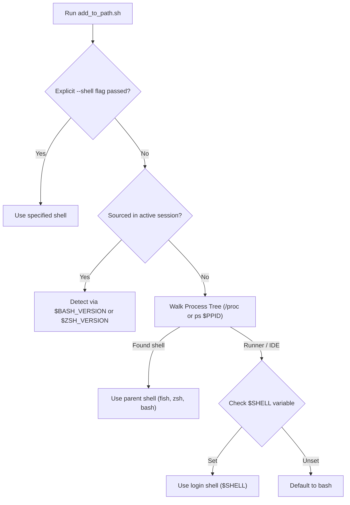

# Shell PATH Configurator (`add_to_path.sh`)

<div align="center">

```
   █████╗ ██████╗ ██████╗     ████████╗ ██████╗     ██████╗  █████╗ ████████╗██╗  ██╗
  ██╔══██╗██╔══██╗██╔══██╗    ╚══██╔══╝██╔═══██╗    ██╔══██╗██╔══██╗╚══██╔══╝██║  ██║
  ███████║██║  ██║██║  ██║       ██║   ██║   ██║    ██████╔╝███████║   ██║   ███████║
  ██╔══██║██║  ██║██║  ██║       ██║   ██║   ██║    ██╔═══╝ ██╔══██║   ██║   ██╔══██║
  ██║  ██║██████╔╝██████╔╝       ██║   ╚██████╔╝    ██║     ██║  ██║   ██║   ██║  ██║
  ╚═╝  ╚═╝╚═════╝ ╚═════╝        ╚═╝    ╚═════╝     ╚═╝     ╚═╝  ╚═╝   ╚═╝   ╚═╝  ╚═╝
```

**Intelligent Shell Detection • Fish Live Command & Config Support • Auto Directory Correction • Zero-Duplicate Idempotency**

**Author:** ShadowHarvy  
**Version:** 1.0.0  
**License:** MIT

</div>

---

## 📋 Table of Contents

- [Overview](#-overview)
- [Key Features](#-key-features)
- [How Shell Detection Works](#-how-shell-detection-works)
- [Fish Shell: Live Command vs Config File](#-fish-shell-live-command-vs-config-file)
- [Default Directory Resolution](#-default-directory-resolution)
- [Usage & Command Options](#-usage--command-options)
- [Examples](#-examples)
- [Verification & Testing](#-verification--testing)

---

## 🌟 Overview

When building a centralized script library (like `~/git/conf/scripts/bin`), running scripts shouldn't require typing `./script.sh` or specifying the full path. They should behave like native system utilities (`git`, `ls`, `curl`).

`add_to_path.sh` detects your active shell environment (`fish`, `bash`, `zsh`, etc.), resolves the target scripts folder, and automatically registers it with your shell's `PATH`.

---

## ✨ Key Features

- **Multi-Shell Detection**: Uses process hierarchy inspection (`ps -p $PPID` walk), `$SHELL`, and interactive sourcing indicators to detect whether you are running `fish`, `bash`, `zsh`, etc.
- **Fish Dual-Mode Support**:
  - **Live Command**: Runs `fish_add_path -U <dir>` to set a Fish Universal variable that takes effect immediately across all running and future fish instances without terminal restarts.
  - **Config File**: Updates `~/.config/fish/config.fish` with deduplication protection.
- **Bash & Zsh Integration**: Adds clean `export PATH="<dir>:$PATH"` entries to `~/.bashrc` and `~/.zshrc`, and provides instant session update instructions or sourcing support.
- **Smart Directory Handling**: Defaults to `~/git/conf/scripts/bin` with automatic detection and correction for typos like `~/git/conf/scripts/bit`.
- **Informative Status Dashboard**: Colorized terminal overview displaying the target path, count of executable scripts, sample tool previews, detected shell, and quick verification tests.
- **All Shells Mode (`--all`)**: Single flag to configure all installed shells on your system at once.
- **Safe & Idempotent**: Prevents duplicate PATH entries; includes `--dry-run` to preview actions before applying.

---

## 🔍 How Shell Detection Works

Because shell scripts run in their own subshell process, standard scripts cannot simply rely on `$0`. `add_to_path.sh` uses a multi-tier detection algorithm:



---

## 🐟 Fish Shell: Live Command vs Config File

In Fish shell, paths can be configured in two distinct ways:

| Method | Mechanism | Scope & Persistence |
| :--- | :--- | :--- |
| **Command (`fish_add_path -U`)** | Universal variable in `$fish_user_paths` | **Instant across all sessions!** Modifies `fish_variables` without editing config files. |
| **File (`config.fish`)** | Appends `fish_add_path <dir>` to `~/.config/fish/config.fish` | Documented in version-controlled config files. |

By default, `add_to_path.sh` uses `--fish-method both`, giving you immediate access in your active terminals while keeping your dotfile config neat and complete. You can customize this with:
```bash
add_to_path.sh --fish-method command   # Only execute universal variable command
add_to_path.sh --fish-method file      # Only append to config.fish
add_to_path.sh --fish-method both      # Default: do both
```

---

## 📂 Default Directory Resolution

When no folder is specified:
1. Checks for `~/git/conf/scripts/bit`: If it exists, uses it.
2. If `bit` does not exist but `~/git/conf/scripts/bin` exists, it automatically resolves to `~/git/conf/scripts/bin` and displays an informative notification.
3. Accepts any custom path: relative paths (`./my-bin`), tilde paths (`~/bin`), or absolute paths (`/opt/tools`).

---

## 🚀 Usage & Command Options

```bash
add_to_path.sh [OPTIONS] [DIRECTORY]
```

### Options

| Option | Flag | Description |
| :--- | :--- | :--- |
| `--shell` | `-s <name>` | Force shell target: `fish`, `bash`, `zsh`, or `all` |
| `--all` | `-a` | Automatically configure all installed shells (`fish`, `bash`, `zsh`) |
| `--fish-method` | `-m <method>` | Set Fish method: `command`, `file`, or `both` (default) |
| `--fix-perms` | `-x` | Automatically run `chmod +x` on script files in the target folder |
| `--dry-run` | `-n` | Preview changes without modifying files or variables |
| `--eval` | `-e` | Output export statement for `eval "$(...)"` |
| `--help` | `-h` | Display help and usage manual |

---

## 💡 Examples

### 1. Default Run (Automatic Detection)
```bash
add_to_path.sh
```
*Detects your shell, adds `~/git/conf/scripts/bin`, and verifies instant availability.*

### 2. Previewing Changes (Dry Run)
```bash
add_to_path.sh --dry-run
```

### 3. Adding a Custom Directory
```bash
add_to_path.sh ~/my-custom-tools
```

### 4. Configuring All Shells at Once
```bash
add_to_path.sh --all
```

### 5. Sourcing in Bash or Zsh for Instant Session Updates
```bash
source add_to_path.sh
```

---

## 🧪 Verification & Testing

Verify that your scripts are accessible globally:

```fish
# In Fish:
which monitor
which network_audit.sh
```

```bash
# In Bash:
which monitor
which network_audit.sh
```

```zsh
# In Zsh:
which monitor
which network_audit.sh
```
